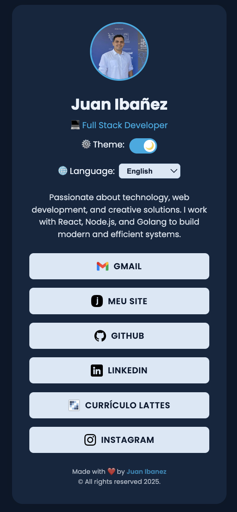

# 🌐 Dev Juan Link Tree

Bem-vindo à minha árvore de links! 🌳  
Uma página centralizada que conecta meus projetos, portfólio e redes sociais como desenvolvedor.

## 📌 Acesse
Visite: <a href="https://dev-juan-ibanez.github.io/dev-juan-link-tree/" target="_blank">Dev Juan Link Tree</a>


## 🚀 O que é?
Uma página simples, responsiva e estilizada com links para:
- 💼 Portfólio no GitHub  
- 🔗 Perfil no LinkedIn  
- 📚 Currículo Lattes  
- ✉️ Contato direto via Gmail  
- 📷 Instagram  
- 🌍 Site pessoal (Github Pages)

## 🌐 Novidades
Agora com **suporte multilíngue automático** (🇧🇷 **Português**, 🇺🇸 **Inglês** e 🇪🇸 **Espanhol**)!  
O idioma é detectado conforme as preferências do navegador, e o usuário pode alternar manualmente no seletor de idioma.  
Além disso:
- Adicionado botão e ícone do **Currículo Lattes**  
- Corrigido link quebrado do **Instagram**  
- Aperfeiçoado layout de **tema + idioma** para uma experiência mais fluida 💫  


## 🛠 Tecnologias Utilizadas
- **HTML5**, **CSS3**, **JavaScript**
- Tema **claro/escuro** com salvamento automático via `localStorage`
- Sistema de **internacionalização (i18n)** para múltiplos idiomas
- Hospedado gratuitamente via **GitHub Pages**

- ## 🛠️ Ícones utilizados

- **FLATICON** Para os ícones utilizados nesse projeto — [Disponível em: https://www.flaticon.com/br/](https://www.flaticon.com/br/)

## 📸 Visualização

<p align="center">
  
  
</p>


## 💻 Como rodar localmente
1. Clone o repositório:  
   ```bash
   git clone https://github.com/dev-juan-ibanez/dev-juan-link-tree.git

2. Acesse a pasta do projeto:
```bash
cd dev-juan-link-tree
```
3. Abra o arquivo index.html diretamente no navegador.

## ☕ Gostou do projeto? Me pague um café!
Se você curtiu o projeto e quer apoiar, pode me pagar um café! ☕  
**Chave PIX**:  
```text
f0098b96-0433-4266-b392-4856d85caadc
```
**(Copie e cole a chave acima para contribuir!)**

## 🧑‍💻 Autor

Feito com ❤️ por **Juan Ibanez**  
🌎 [LinkedIn](https://www.linkedin.com/in/juan-ibanez-df/) | [GitHub](https://github.com/dev-juan-ibanez) | [Lattes](https://lattes.cnpq.br/1029223661167123)


